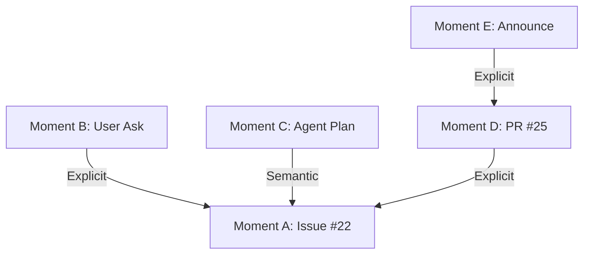

# Runtime Architecture Blueprint

## 1. Purpose

The **Machinen Engine** is the central processing brain for the Knowledge Graph. It transforms raw inputs (activity streams, docs) into structured Moments and Links.

It is designed to be **Unified**: exact same business logic runs in **Live** (Low Latency) and **Simulation** (High Throughput) modes.

## 2. Core Architecture: The Unified Orchestrator

To prevent "Live/Sim Schism", we enforce a single code path for execution.

### 2.1 The Single Loop
There is only one Orchestrator function: `executePhase`.

**Rationale: Avoiding Live/Sim Schism**
Maintaining separate code paths for real-time (Live) and batch (Simulation) execution inevitably leads to behavioral drift. By enforcing a single orchestrator, we ensure that fixes and improvements apply to both modes simultaneously. Differences in behavior are strictly isolated to **Storage** and **Transition** strategies.

```typescript
// THE SINGLE SHARED CODE PATH
async function executePhase(
  phase: Phase, 
  input: any, 
  strategies: { storage: StorageStrategy, transition: TransitionStrategy },
  context: PipelineContext
) {
  // Inject storage into context so phases can pull from history
  context.storage = strategies.storage;

  // 1. Execute Logic (Identical)
  const output = await phase.execute(input, context);
  
  // 2. Persist State (Varies by Strategy)
  await strategies.storage.save(phase, input, output);
  
  // 3. Trigger Next (Varies by Strategy)
  await strategies.transition.dispatchNext(phase.next, output, input);
}
```

### 2.2 Stateless Phase Execution via Context
Memory is our scarcest resource (128MB limit). We cannot pass huge objects between functions or hold the graph in memory.
Instead, we use **Stateless Execution with Context**.

**Rationale: Infrastructure Constraints**
Cloudflare Workers impose strict CPU and memory limits. A monolithic memory-resident graph would crash under load. Statelessness allows our workers to remain ephemeral and scales horizontally by fetching only the necessary sub-graph (by ID) for each specific phase execution.

**The Rule**: Logic functions are pure-ish. They accept an ID (`input`) and a capability bag (`context`). They MUST fetch what they need from the DB using the ID, and write their results back via the Context.

```typescript
type PhaseExecution<TInput, TOutput> = (
  input: TInput,
  context: PipelineContext // The Side-Effect Handle
) => Promise<TOutput>;

interface PipelineContext extends IndexingHookContext {
  db: Database;       // Read/Write Graph Data
  vector: VectorIndex; // Read/Write Embeddings
  env: Env;           // Config & Keys
  llm: LLMProvider;   // Reasoning
  storage: StorageStrategy; // Load/Save artifacts from any phase
}
```

## 3. Plugin Architecture: Domain Logic Injection

The Pipeline itself is generic. All domain-specific knowledge (how to parse GitHub, how to chunk Discord) is injected via **Plugins**.

Plugins live in `src/app/engine/plugins/`. They provide hooks for:
1.  **Ingestion/Diffing**: Converting raw JSON `{"issue_url": ...}` into a standardized `Document` object.
2.  **Chunking**: Breaking a `Document` into `Chunk[]` based on domain rules (e.g. separating PR body from comments).
3.  **Prompting**: Providing the context string ("This is a PR, assume text supports...") for the LLM.

### 3.1 Composition Strategies
The engine orchestrates plugins using three strategies (implemented in `src/app/engine/indexing/pluginPipeline.ts`):
*   **First-Match**: Invokes plugins in order; first non-null wins. (Used for: `prepareSourceDocument`, `splitDocumentIntoChunks`).
*   **Waterfall**: Output of Plugin A -> Input of Plugin B. (Used for: `enrichChunk`).
*   **Collector**: All plugins run, results aggregated. (Used for: `buildVectorSearchFilter`).

## 4. Execution Strategies

We inject behavior to handle the different constraints of Live vs Simulation.

### 3.1 Live Strategy (Minimizing Latency)
*   **Goal**: Process a webhook as fast as possible.
*   **Storage**: `NoOpStorage` (or `LogStorage`). We don't save intermediate state to DB to save milliseconds.
*   **Transition**: `QueueTransition`. We enqueue a job for the next phase to ensure reliability and respect the 30s CPU limit (avoiding deep recursion).
*   **Context**: `LiveContext`. Connects to real-time environment.

### 3.2 Simulation Strategy (Maximizing Throughput & Inspectability)
*   **Goal**: Process 10,000+ items without crashing.
*   **Storage**: `ArtifactStorage`. We persist input/output to `simulation_run_artifacts` for checkpointing and UI debugging.
*   **Transition**: `QueueTransition`. We enqueue a job for the next phase. This breaks the stack, respects the 30s timeout, and allows the Supervisor to pace the work (Backpressure).
*   **Context**: `SimulationContext`. Can mock time or external APIs.

## 4. System Constraints

1.  **UNIFIED ORCHESTRATOR**: There is only ONE execution code path: `executePhase`.
2.  **STRATEGY INJECTION**: Differences between Live/Sim are solely handled by `StorageStrategy` and `TransitionStrategy`.
3.  **QUEUE BOUNDARY**: Both strategies use `QueueTransition` for reliability. Recursion is avoided to prevent CPU Timeouts (30s limit).
4.  **No Per-Phase Runners**: All orchestration usage must go through the generic pipeline.
5.  **Statelessness**: Workers are ephemeral.
6.  **Infrastructure Isolation**: Data is strictly partitioned by `momentGraphNamespace`. In simulations, this namespace is prefixed (e.g., `local-date:redwood:rwsdk`) to ensure simulation runs do not contaminate live data while maintaining project-level isolation.
7.  **Self-Contained Simulation Artifacts**: For large-scale simulations, artifacts MUST be enriched with all necessary metadata (e.g., Titles/Summaries) to make them self-contained for UI rendering. Relational joins for metadata in the UI data layer are prohibited on the critical path to avoid database parameter limits.
8.  **Completion Settlement**: Simulation runs transition through a `settling` state before marking as `completed`. This synchronizes the logical end of the work with the asynchronous flush of event logs and artifacts. **The simulation runner MUST correctly acquire locks for all active statuses (including `settling` and `advance`) to ensure terminal state transitions achieve eventual consistency.**
9.  **Robust Reasoning Extraction**: Any LLM-based selection or classification judgment must use resilient parsing (e.g., `parseLLMJson`) to extract valid structured data regardless of markdown formatting or conversational noise in the model output.

## 4. The 8-Phase Lifecycle (Detailed Flow)

This data flow describes exactly what happens to a document as it moves through the system.

### Phase 1: Ingest & Diff
*   **Goal**: Fetch raw state and decide if it changed.
*   **Input**: `r2_key` (Pointer to raw JSON in object storage).
*   **Context Read**: 
    *   Fetches the JSON from R2.
    *   Checks `db.document_checksums` to see if we've processed this before.
    *   **Namespace Resolution**: Resolves the document's project scope (`baseNamespace`) using domain-specific plugins.
*   **Validation**: Plugin parses R2 key -> validates structure -> normalizes to `Document`.
*   **Context Write**: 
    1. Updates `db.document_checksums` if changed.
    2. Persists `baseNamespace` in the phase artifact for use in subsequent phases.
*   **Output**: `Document` object + `baseNamespace` or `null` (if skipped).

### Phase 2: Micro-Batches (Chunk & Embed)
*   **Goal**: Prepare atomic units for Vector Search.
*   **Input**: `Document`.
*   **Context Read**: None (Pure transformation).
*   **Logic**: 
    1.  Plugin splits `Document` -> `Chunk[]`.
    2.  Model generates `Embedding` (Vector) for each Chunk.
*   **Context Write**: 
    *   Writes `embeddings` to Vector DB.
    *   Stores `MicroMoment` items in temporary artifact storage (not main DB yet).
*   **Output**: `MicroMoment[]` (List of chunks + vectors).

### Phase 3: Macro Synthesis (Interpretation)
*   **Goal**: Understand the "Stream of Consciousness".
*   **Input**: `MicroMoment[]`.
*   **Context Read**: None.
*   **Logic**: 
    1.  LLM reads the stream of text chunks.
    2.  **Context Injection**: Utilizes `macroSynthesisPromptContext` (passed from document metadata) to provide domain-specific guidance (e.g., "Summarize this as a technical investigation").
    3.  Synthesizes a narrative summary ("User X proposed Y", "PR Z implemented Y").
*   **Context Write**: Extracts **Anchor Tokens** (Issue refs, code identifiers) and attaches them to the macro-moments.
*   **Output**: `MacroStream[]` (Draft moments with anchors).

### Phase 4: Classification
*   **Goal**: Filter noise and Tag.
*   **Input**: `MacroStream[]`.
*   **Logic**: LLM decides: Is this a "Bg Fix"? A "Feature Request"? Just "Chore"?
*   **Output**: `ClassifiedStream[]`.

### Phase 5: Materialize (The Commit)
*   **Goal**: Make it Real.
*   **Input**: `ClassifiedStream[]`.
*   **Context Read**: None.
*   **Context Write**: 
    *   **INSERT** into `moments` table. 
    *   Assigns permanent **UUIDs**.
*   **Output**: `Moment[]` (The graph nodes).

> **Sync Barrier**: Once this phase completes, the data is visible to the rest of the system.

**Rationale: The Global Decision Barrier (Materialize vs. Link)**
To avoid "local optimum" failures in the graph, we enforce a strict separation between **Interpretation** (Phases 1-5) and **Connection** (Phases 6-8). Pre-interpreting and materializing the entire pool of moments before attempting to link ensures that our linking decisions are made with the benefit of the complete candidate set. This prevents the system from choosing a poor parent link simply because it was the first one available in a sequential or partial stream - we act as a **Rational Reporter**, selecting the best possible connection from the full history.

### Phase 6: Deterministic Linking
*   **Goal**: Link what we know for sure (Zero Hallucination).
*   **Input**: `moment_id`.
*   **Context Read**: 
    *   Reads `moment` body and `anchors`. 
    *   Resolves explicit cross-links (e.g., `Fixes #123`) using `resolveThreadHeadForDocumentAsOf`.
*   **Context Write**: 
    *   **INSERT** into `links` table (e.g. `PR -> Issue`).

**Rationale: Decoupling Continuity from Cross-Linking**
This phase is restricted to explicit, unambiguous cross-links (e.g. Git refs). It specifically avoids "stream chaining" (sequential document moments) to prevent forcing linear timelines. Moving continuity evaluation to Phase 8 allows the system to prioritize cross-document links if they present a stronger signal than the default sequential link.

*   **Output**: `ParentLink` structure (for logging).

### Phase 7: Candidate Generation (Hybrid Retrieval)
*   **Goal**: Find what *might* be related.
*   **Input**: `moment_id`.
*   **Logic**:
    1.  **Semantic Search**: `context.vector.query(embedding)` finds conceptually similar moments.
    2.  **Explicit Search**: Queries SQLite `moment_anchors` for moments sharing exact tokens (Issue refs, PRs, code).
    3.  **Merged Candidates**: Combines both sets. Same-document moments are NO LONGER filtered out, allowing stream-chaining to be evaluated.

**Rationale: Semantic Generator vs. Continuity Evidence**
Vector similarity is excellent at finding "same subject area" content but poor at distinguishing "same work item timeline". High semantic similarity can cause false-positive links between unrelated tasks. We use SQLite for anchor matching because strict token equality is a more reliable indicator of work continuity than vector distance, and relational queries are significantly faster than metadata filtering in high-cardinality vector indexes.
*   **Context Read**: 
    *   Vector Index returns top K matches (IDs + Scores).
    *   SQLite returns exact anchor matches.
    *   Fetches metadata for all IDs from `db`.
*   **Output**: `Candidate[]`.

> **Note**: This phase can only find candidates that have already been **Materialized** (Phase 5).

### Phase 8: Timeline Fit (The Judgment)
*   **Goal**: Finalize the Graph.
*   **Input**: `moment_id`, `Candidate[]`.
*   **Logic**: 
    1.  **Chronological Filtering**: All candidates are strictly filtered to ensure `parent.timestamp < child.timestamp`. Candidates violating this are rejected with `time-inversion` and never reach the LLM.
    2.  **Continuity Priority**: If the child moment has an explicit `predecessorMomentId` (from materialization), that moment is prioritized as P1.
    3.  **Blended Shortlisting**: All other valid candidates are ranked using a blended signal of semantic similarity and shared anchors. The top 10 are passed to the LLM.
    4.  **Ancestry Context**: For each candidate, the orchestrator walks up the link chain to retrieve the last 5-10 moments in its history, providing a narrative context for the judgment.
    5.  **LLM Selection**: The LLM identified the "natural continuation" by reviewing the Child against the Candidate AND its historical ancestry.
    6.  **Selection**: The LLM choice is accepted if it satisfy the narrative progression requirements.

#### LLM Selection Specification
The selector must prioritize **narrative progression** over keyword matching.

**Linking Definition**:
A "Link" represents a natural progression or significant development within a specific narrative thread or subject.
- *Examples*: A problem being investigated, an initiative reaching a milestone, a question being answered, or a situation evolving due to a new event (e.g. "Company hire" -> "Consequent performance win").
- *Non-Examples*: General status markers without development, unrelated events occurring concurrently in the same environment, or superficial semantic overlap.

**Prompt Structure**:
```text
Role: You are the Timeline Fit Judge for Machinen.
Context: We are rebuilding a work timeline from fragmented events (moments).
Job: Select the ONE candidate (if any) that represents the most natural continuation of the timeline of moments.

### WHAT IS A "NATURAL CONTINUATION"?
A link is only valid if the Child is a natural next step or significant development of the Parent's activity.
- LINK: A situation -> Its evolution or consequence (e.g., Company hire -> Consequent win).
- LINK: A problem -> Its investigation or resolution.
- LINK: An initiative -> Its next major milestone.
- LINK: A question -> Its answer.
- LINK: Part 1 of a narrative -> Part 2 of that same narrative.

- NO LINK: Two unrelated events happening at the same time.
- NO LINK: Superficial semantic overlap (e.g. both mentions the same entities or terms but in entirely different contexts).

### CONTEXT
- Child Moment: {{child_text}}
- Child Timestamp: {{child_time}}

### CANDIDATES
{{#each candidates}}
[{{index}}] ID: {{id}}
TITLE: {{title}}
SUMMARY: {{summary}}
TIME: {{relative_time}} earlier

#### ANCESTRY (HISTORY OF THIS CANDIDATE)
{{#each ancestry}}
- {{title}}: {{summary}}
{{/each}}
---------------------------------
{{/each}}

### OUTPUT
Return JSON:
{
  "selectedId": "...", // The ID of the best parent, or null if none fit
  "note": "..." // A brief 1-sentence explanation of why this is the natural progression.
}
```
*   **Context Write**: 
    *   **INSERT** into `links` table if a parent is selected.
    *   **Decision Audit**: Log the chosen parent and the specific evidence (blended scores + LLM selection reasoning).
    *   **Enrichment**: The artifact is updated with `childTitle`, `childSummary`, `chosenParentTitle`, and `chosenParentSummary` for optimized UI rendering.
*   **Output**: `FinalDecision`.

## 5. End-to-End Walkthrough: "The Prefetching Story"

**Scenario**: A feature lifecycle involving 5 distinct documents spanning 3 days.

**The Timeline**:
1.  **Day 1 10:00 (Doc A)**: GitHub Issue #22 "Support Prefetching".
2.  **Day 1 14:00 (Doc B)**: Discord User: "Can I prefetch links?" Team at-mention: "See #22".
3.  **Day 2 09:00 (Doc C)**: Discord Agent Chat: "How would I implement prefetching?" (Dev planning).
4.  **Day 3 10:00 (Doc D)**: GitHub PR #25 "Feat: Client-side prefetching. Solves #22".
5.  **Day 3 12:00 (Doc E)**: Discord Announcement: "Prefetching is out! See PR #25".

### Process Flow Execution

#### Step 1: Processing Doc A (Issue #22)
*   **Ingest**: Plugin validates Github Issue.
*   **Materialize**: Comes out as `Moment A (UUID: 111)`.
*   **Linking/Fit**: No candidates found (it's the first doc).

#### Step 2: Processing Doc B (Discord "See #22")
*   **Materialize**: Becomes `Moment B (UUID: 222)`.
*   **Deterministic Linking**:
    *   Regex finds "#22".
    *   `db.find('gh_issue:22')` -> Returns `Moment A`.
    *   **Write**: Link `B -> A (Explicit)`.

#### Step 3: Processing Doc C (Agent Chat)
*   **Micro-Batching**: Chunked into "Micro-Moment: How to implement...".
*   **Materialize**: Becomes `Moment C (UUID: 333)`.
*   **Candidate Generation**:
    *   `vector.query("implement prefetching")`.
    *   Results: `[Moment A (Issue), Moment Z (Noise)]`.
*   **Timeline Fit**:
    *   LLM Input: "Moment C matches Moment A. Valid?".
    *   Check: Day 2 (Chat) is after Day 1 (Issue). **PASS**.
    *   **Write**: Link `C -> A (Semantic)`.

#### Step 4: Processing Doc D (PR #25)
*   **Materialize**: Becomes `Moment D (UUID: 444)`.
*   **Deterministic Linking**:
    *   Regex finds "Solves #22".
    *   `db.find('gh_issue:22')` -> Returns `Moment A`.
    *   **Write**: Link `D -> A (Explicit)`.

#### Step 5: Processing Doc E (Announcement)
*   **Materialize**: Becomes `Moment E (UUID: 555)`.
*   **Deterministic Linking**:
    *   Regex finds "PR #25".
    *   `db.find('gh_pr:25')` -> Returns `Moment D`.
    *   **Write**: Link `E -> D (Explicit)`.

### The Final Graph


## 6. Code Structure & Directory Mapping

The codebase reflects the Unified Pipeline architecture by co-locating domain logic with its infrastructure counterparts.

### 6.1 The Feature Pipeline (`src/app/pipelines/`)

Each of the 8 phases is encapsulated in its own directory. This co-location ensures that for any given phase, we can find both the engine logic and the supporting UI.

```text
src/app/pipelines/
├── [phase_name]/          # Specialized logic for one of the 8 phases
│   ├── index.ts           # Phase definition (Type constraints, next phase)
│   ├── engine/
│   │   └── core/
│   │       └── orchestrator.ts # The phase-specific business logic 
│   └── web/               # UI components for simulator & debugging
│       ├── ui/            # React components (e.g., DetailCards)
│       └── routes/        # Next.js page definitions for the phase
└── registry.ts            # Central registry allowing lookups by phase name
```

### 6.2 The Engine Core (`src/app/engine/`)

The core engine provides the runtime and plugin infrastructure that powers all phases.

```text
src/app/engine/
├── runtime/               # Core execution loop
│   ├── orchestrator.ts    # Defines executePhase() - the "Inner Loop"
│   └── strategies/        # Storage/Transition bridge for Live vs. Simulation
│       ├── live.ts        # NoOpStorage, QueueTransition (Live entry)
│       └── simulation.ts  # ArtifactStorage, QueueTransition (Sim entry)
├── indexing/
│   └── pluginPipeline.ts  # Generic engine for Waterfall/Collector plugin composition
├── databases/
│   └── momentGraph/       # The core Knowledge Graph schema (Nodes & Edges)
├── simulation/
│   └── runArtifacts.ts    # Cross-phase state persistence and inspectability
├── runners/
│   └── simulation/runner.ts # The "Tick" driver for simulation progression
└── services/              # Infrastructure-to-Engine entry points (Workers)
```

### 6.3 Infrastructure Entry Point (`src/worker.tsx`)

The system plugs into the Cloudflare environment via the top-level `src/worker.tsx`. This is where high-level routing occurs for both `fetch` and `queue` events.

#### Queue Routing
Incoming jobs from Cloudflare Queues are routed based on `queueName` and `jobType`:
- **Indexing Jobs**: Jobs from `ENGINE_INDEXING_QUEUE` are routed to `processIndexingJob` (Live) or `processSimulationJob` (Simulation) based on whether the `jobType` is simulation-specific (e.g., `simulation-advance`).
- **Chunk Processing**: Chunks are processed in batches via `processChunkBatch`.
- **R2 Events**: Automatic indexing is triggered by R2 object creation events (e.g., `PutObject` for `latest.json`).

### 6.4 Strategic Co-location Rationale

1.  **Phase Autonomy**: Each phase in `src/app/pipelines` is "whole". It defines what it does, how it renders in the simulator, and its core engine logic. (Historical simulation-specific helpers have been consolidated into core logic or simulation strategies).
2.  **Strategy Isolation**: The logic for *how* to save state or *how* to transition is entirely decoupled from the phase logic itself, living in `src/app/engine/runtime/strategies/`.
3.  **Plugin Decoupling**: Ingestion and domain-specific normalization are handled by `src/app/engine/plugins/`, allowing the engine to remain agnostic to the source material (e.g., GitHub issue vs. Discord message).
