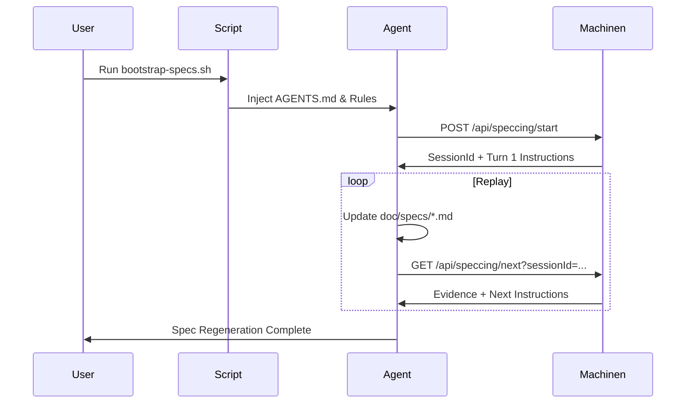

# Architecture Blueprint: Speccing Engine & Platform

## 2000ft View Narrative
The Machinen Speccing system is a reconstructive sub-system designed to generate high-fidelity technical specifications by replaying a project's historical development narrative. It provides a zero-installation, cross-editor framework that replaces custom editor extensions and CLIs with a "Self-Instructing API". The system acts as a deterministic, time-locked "Historical Oracle" for IDE-based AI agents, ensuring the generated spec remains the true "Source of Truth" for the system.

## High-Level Structure
The system is composed of two primary facets:
1.  **The Engine (The Brain)**: 
    - **Storage (`SpeccingStateDO`)**: Dedicated SQLite-backed Durable Object for managing session state (PQ tracking, drafts).
    - **Runner (`SpeccingRunner`)**: Orchestrates the Priority Queue (PQ) walk and evidence retrieval.
    - **Hooks (`timeTravel`)**: Provider-specific filters that ensure data fidelity at any given historical timestamp.
2.  **The Platform (The Interface)**:
    - **Bootstrap (`bootstrap-specs.sh`)**: A POSIX-compliant script that injects Machinen's protocol into any project.
    - **Instruction Layer (`AGENTS.md`)**: The universal prompt protocol that onboards agents.
    - **Self-Instructing API**: Delivers the next action (curls + instructions) as part of every JSON response.

## System Flow: The Universal Actor
Machinen manages the complexity of historical state while the IDE agent performs the work.

1.  **Bootstrap**: User runs `curl | bash` to inject rules and protocol into the target repository.
2.  **Session Start**: POST `/api/speccing/start?subjectId=...` initializes the `SpeccingStateDO` and PQ.
3.  **The Turn Cycle**:
    - Machinen pops the earliest moment $M$ from the PQ.
    - **Time-Locked Evidence**: Provider plugins (GitHub, Cursor, Discord) filter data to match $M.createdAt$.
    - **Agent Action**: Machinen returns JSON with raw context + turn-by-turn instructions.
    - **PQ Expansion**: Child moments are discovered and pushed back to the PQ.
4.  **Completion**: Once the PQ is empty, the agent finalizes the specification document.

## Database Schema: \`speccing_sessions\`
Stored in the dedicated `SpeccingStateDO`.

| Table | Column | Type | Description |
| :--- | :--- | :--- | :--- |
| **speccing_sessions** | id | text (PK) | Unique session identifier. |
| | subject_id | text | The root subject being replayed. |
| | priority_queue_json | text | Ordered list of candidate moments. |
| | processed_ids_json | text | Audit trail of processed moments. |
| | working_spec | text | The evolving draft of the specification. |
| | status | text | active \| completed \| failed. |

## Behavior Spec

### Chronological Fidelity (PQ Walk)
- **GIVEN**: A Moment Graph with a root $A$ and children $B$ (created at T1) and $C$ (created at T2).
- **WHEN**: Subject $A$ is replayed.
- **THEN**: Moment $B$ must always be presented to the agent before Moment $C$.
- **AND**: Moment $B$'s evidence must not include any events or comments created after T1.

### Branching Narrative
- **GIVEN**: A subject with multiple parallel PRs.
- **WHEN**: The PQ is processed.
- **THEN**: The agent re-lives the work in the exact global order it occurred, merging the parallel narratives into a single, cohesive technical specification.

## Requirements, Invariants & Constraints
- **Absolute Time-Lock**: No data leakage from the "future" relative to the current moment.
- **Zero Bridge**: No reliance on IDE-specific APIs or custom editor extensions (Pure Web).
- **Domain-Specific Storage**: Speccing session data is isolated in a dedicated DO.
- **Native Adherence**: IDE-specific rule files must contain the full protocol (not redirects) to minimize agent reasoning tax.
- **POSIX Compliance**: Bootstrap script must run on any standard shell without external dependencies beyond `curl`.

## Learnings & Anti-Patterns
- **Anti-Pattern: Custom CLIs**: Moving to a Bash-first injector achieved "instant installation" and avoided distribution friction.
- **Anti-Pattern: MCP Discovery**: Discovery via standard HTTP/JSON remains superior to the complexity of MCP for this use case.
- **Learning: Full Rule Duplication**: Agents perform better when the full protocol is in their "Immediate Rules" rather than a separate file.
- **Learning: PQ Dominance**: Attempting to walk the graph without a session-aware PQ led to chronological drift in branching narratives.
