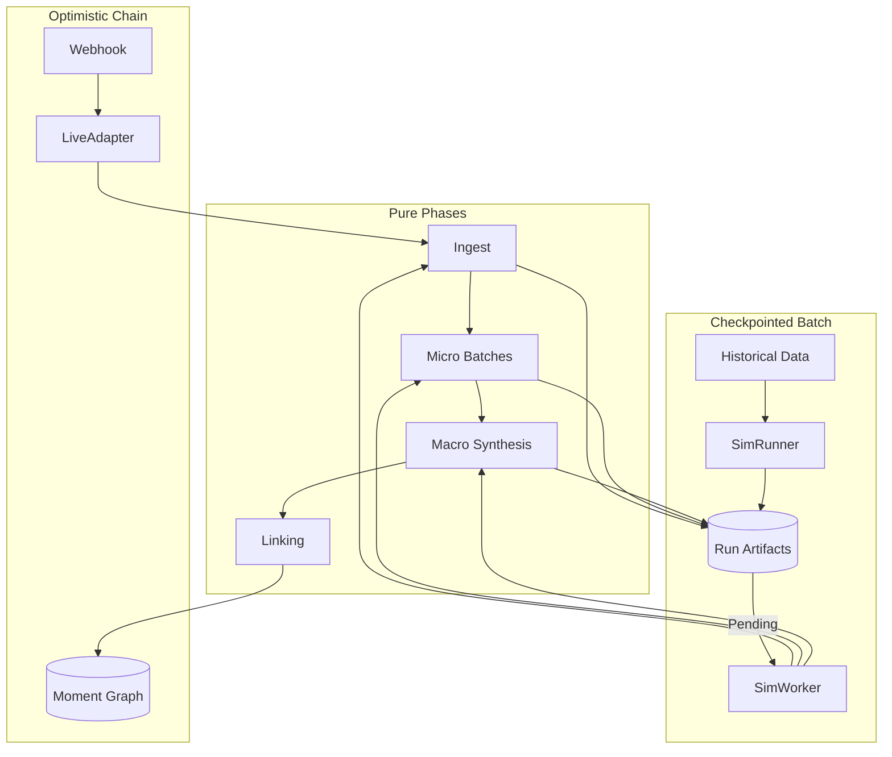

# System Overview Blueprint

**Status**: Living Document
**Last Updated**: 2026-02-02

## 1. High-Level Architecture

Machinen is a system for transforming raw, noisy software activity streams (GitHub, Discord) into a structured, queryable **Knowledge Graph**.

It operates using a **Unified Pipeline** architecture:

1.  **Shared Phase Logic**: All business logic (decisions, synthesis, linking) resides in pure, composable "Phases" (`src/app/engine/phases/`).
2.  **Live Execution**: Chains phases together in-memory via the `LiveAdapter` for optimistic, low-latency processing.
3.  **Simulation Execution**: Steps through phases using the `SimulationAdapter`, which checkpoints state to `simulation_run_artifacts` for rigor, determinism, and backfilling.

## 2. The Phase Core Pattern

To guarantee that backtests matches live behavior, we strictly separate **Logic** from **Orchestration**.

*   **Phase Logic**: Pure functions defining *what* happens (e.g., "Summarize these chunks"). Located in `src/app/engine/phases/`.
*   **Adapters**: Define *how* it runs.
    *   **Live Adapter**: "Do logical step A, then immediately do B."
    *   **Simulation Adapter**: "Do logical step A, save result. If success, enqueue job for B."

## 3. The 8-Phase Lifecycle

Data flows through 8 distinct phases.

| Phase | Responsibility | Input | Output |
| :--- | :--- | :--- | :--- |
| **1. Ingest Diff** | Change Detection | Source Documents | Changed `R2Key` list |
| **2. Micro Batches** | Segmentation | Changed Docs | atomic `MicroBatch` list (Cached) |
| **3. Macro Synthesis** | Summarization | Micro Batches | `MacroMoment` list (Summarized) |
| **4. Macro Classify** | Labeling | Macro Moments | Types (`Bug`, `Feature`) |
| **5. Materialize** | Persistence | Macro Moments | `Moment` Rows (Stable IDs, Unlinked) |
| **6. Deterministic Link** | High-Conf Linking | Moments | `ParentLink` (Explicit refs) |
| **7. Candidate Sets** | Recall/Search | Unlinked Moments | List of `Candidate` Parents |
| **8. Timeline Fit** | Precision/Decision | Candidates | Final `ParentLink` Decision |

## 4. Invariants & System Constraints

*   **Namespace Isolation**: All reads/writes must be scoped to a specific `namespace` (and optional `prefix`). Test runs should never pollute Production graphs.
*   **Idempotency**: Rerunning a phase with identical inputs must produce identical outputs.
*   **Chronology**: A Child Moment can never be older than its Parent Moment. Time travel is forbidden.
*   **Bounded Work**: All phases must operate on bounded inputs (chunk limits, candidate caps) to prevent OOMs or timeouts.
