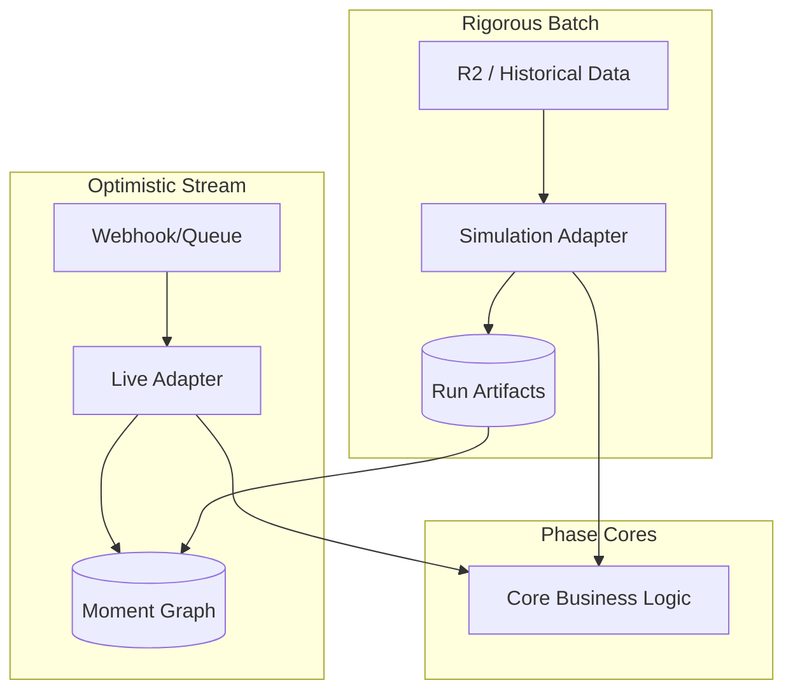

# System Overview Blueprint

**Status**: Living Document
**Last Updated**: 2026-01-26

## 1. High-Level Architecture

Machinen is a system for transforming raw, noisy software activity streams (GitHub, Discord) into a structured, queryable **Knowledge Graph**.

It operates using a **Dual Pipeline** architecture:

1.  **Live Pipeline**: Optimized for latency. Processes events as they arrive, acting optimistically.
2.  **Simulation Pipeline**: Optimized for rigor, inspectability, and "backfilling". Processes data in restartable batches.

Both pipelines share the same **Phase Cores** (Business Logic) but use different **Adapters** (Runtime Wiring).

## 2. The Phase Core Pattern

To prevent logic drift between Live and Simulation, we use the **Phase Core** pattern.

*   **Phase Core**: Pure-ish functions that define *decisions* (e.g., "Is this moment a bug?", "Does X link to Y?"). They are stateless and authoritative.
*   **Adapters**: Handle the "Where does data come from?" and "Where does it go?" questions.
    *   **Live Adapter**: Reads from event hooks, writes directly to DB.
    *   **Simulation Adapter**: Reads from `simulation_*` tables, writes to `simulation_*` tables, and eventually materializes to the DB.

## 3. The 8-Phase Lifecycle

Data flows through 8 distinct phases. In Simulation, these are explicit stop/start boundaries. In Live, they may flow contiguously.

| Phase | Responsibility | Input | Output |
| :--- | :--- | :--- | :--- |
| **1. Ingest Diff** | Change Detection | Source Documents | Changed `R2Key` list |
| **2. Micro Batches** | Segmentation | Changed Docs | atomic `MicroBatch` list (Cached) |
| **3. Macro Synthesis** | Summarization | Micro Batches | `MacroMoment` list (Summarized) |
| **4. Macro Classify** | Labeling | Macro Moments | Types (`Bug`, `Feature`) |
| **5. Materialize** | Persistence | Macro Moments | `Moment` Rows (Stable IDs, Unlinked) |
| **6. Deterministic Link** | High-Conf Linking | Moments | `ParentLink` (Explicit refs) |
| **7. Candidate Sets** | Recall/Search | Unlinked Moments | List of `Candidate` Parents |
| **8. Timeline Fit** | Precision/Decision | Candidates | Final `ParentLink` Decision |

## 4. Invariants & System Constraints

*   **Namespace Isolation**: All reads/writes must be scoped to a specific `namespace` (and optional `prefix`). Test runs should never pollute Production graphs.
*   **Idempotency**: Rerunning a phase with identical inputs must produce identical outputs (verified via content hashing).
*   **Chronology**: A Child Moment can never be older than its Parent Moment. Time travel is forbidden.
*   **Bounded Work**: All phases must operate on bounded inputs (chunk limits, candidate caps) to prevent OOMs or timeouts.
