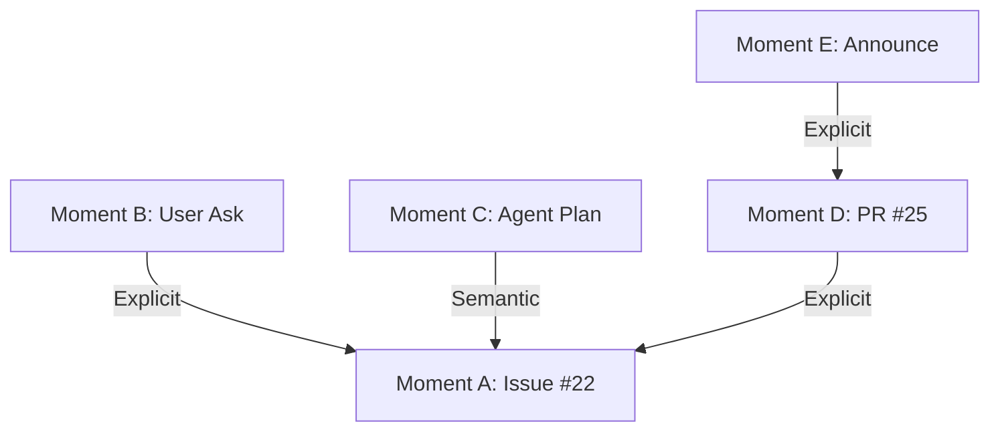

# Unified Pipeline Blueprint

## 1. Purpose

The **Machinen Engine** is the central processing brain for the Knowledge Graph. It transforms raw inputs (activity streams, docs) into structured Moments and Links.

It is designed to be **Unified**: exact same business logic runs in **Live** (Low Latency) and **Simulation** (High Throughput) modes.

## 2. Core Architecture: The Unified Orchestrator

To prevent "Live/Sim Schism", we enforce a single code path for execution.

### 2.1 The Single Loop
There is only one Orchestrator function: `executePhase`.

```typescript
// THE SINGLE SHARED CODE PATH
async function executePhase(
  phase: Phase, 
  input: any, 
  strategies: { storage: StorageStrategy, transition: TransitionStrategy },
  context: PipelineContext
) {
  // 1. Execute Logic (Identical)
  const output = await phase.execute(input, context);
  
  // 2. Persist State (Varies by Strategy)
  await strategies.storage.saveArtifact(phase, input, output);
  
  // 3. Trigger Next (Varies by Strategy)
  await strategies.transition.dispatchNext(getStep(phase).next, output);
}
```

### 2.2 Co-located Domain Logic
All logic is organized by **Domain** in `src/app/pipelines/<phase>/`.
*   **Core**: Shared Business Logic + Phase Definitions.
*   **Web**: UI Components.
*   **Live/Sim**: Strategy Definitions (if needed).

**CRITICAL CONSTRAINT**: There are **NO PER-PHASE RUNNERS**. The generic `executePhase` function handles everything.

### 2.3 Stateless Phase Execution via Context
Memory is our scarcest resource. We cannot pass huge objects between functions in a serverless environment.
Instead, we use **Stateless Execution with Context**.

```typescript
type PhaseExecution<TInput, TOutput> = (
  input: TInput,
  context: PipelineContext // The Side-Effect Handle
) => Promise<TOutput>;

interface PipelineContext extends IndexingHookContext {
  // 1. Database Access (Read Metadata, Write Findings)
  db: Database;
  
  // 2. Vector Search (Candidate Generation)
  vector: VectorizeIndex;
  
  // 3. Environment (Config, API Keys)
  env: Env;
  
  // 4. LLM Access (Reasoning)
  llm: LLMProvider;
}
```

**The Rule**: Logic functions are pure-ish. They accept an ID (`input`) and a capability bag (`context`). They must fetch what they need from the DB using the ID, and write their results back via the Context.

## 3. Plugin Architecture: Domain Injection

The Pipeline itself is generic. All domain-specific knowledge (how to parse GitHub, how to chunk Discord) is injected via **Plugins**.
Plugins live in `src/app/engine/plugins/`.

### 3.1 The Plugin Interface
Plugins provide hooks for specific phases:

```typescript
interface Plugin {
  name: string;
  
  // Phase 1: Ingest (Raw -> Document)
  prepareSourceDocument(context: IndexingHookContext): Promise<Document | null>;
  
  // Phase 2: Micro-Batching (Document -> MicroMoment[])
  splitDocumentIntoChunks(doc: Document): Promise<Chunk[]>;
  
  // Phase 3: Macro-Synthesis (Context Injection)
  subjects?: {
    getMicroMomentBatchPromptContext(...): Promise<string>;
  };
}
```

### 3.2 Strategy
*   **Waterfall**: Try plugins one by one until a match is found (e.g., Ingestion).
*   **Collector**: Run all matching plugins and aggregate results (e.g., Evidence Gathering).

## 4. Execution Strategies

We inject behavior to handle the different constraints of Live vs Simulation.

### 4.1 Live Strategy (Minimizing Latency)
*   **Goal**: Process a webhook as fast as possible.
*   **Storage**: `NoOpStorage`. No intermediate DB writes.
*   **Transition**: `DirectTransition`. In-memory recursion.
*   **Context**: `LiveContext`. Real-time environment.

### 4.2 Simulation Strategy (Maximizing Throughput & Inspectability)
*   **Goal**: Process 10,000+ items safely.
*   **Storage**: `ArtifactStorage`. Persist to `simulation_run_artifacts` table.
*   **Transition**: `QueueTransition`. Enqueue next job (Backpressure).
*   **Context**: `SimulationContext`. Mocked time/APIs.

## 5. The 8-Phase Lifecycle

| Phase | Input | Context | Output | Description |
| :--- | :--- | :--- | :--- | :--- |
| **1. Ingest** | `r2_key` | Plugin | `Document` | Fetch raw JSON, normalize to standard Document. |
| **2. Micro Batches** | `Document` | Plugin | `MicroMoment[]` | Split into Chunks, Embed them. These are "Micro-Moments". |
| **3. Macro Synthesis** | `MicroMoment[]` | LLM | `MacroStream[]` | Interpret the stream of micro-moments into a narrative. |
| **4. Classification** | `MacroStream` | LLM | `ClassifiedStream` | Filter noise, tag as Opportunity/Problem. |
| **5. Materialize** | `ClassifiedStream` | DB Write | `Moment[]` | **COMMIT POINT**. Assign stable IDs and write to Graph DB. |
| **6. Linking** | `moment_id` | DB Read | `ParentLink` | Deterministic linking (e.g. "Fixes #123"). |
| **7. Candidates** | `moment_id` | Vector | `Candidate[]` | Fuzzy search for related past moments. |
| **8. Timeline Fit** | `moment_id` | LLM | `FinalDecision` | Judge best parent from candidates. |

## 6. End-to-End Walkthrough: "The Prefetching Story"

**Scenario**: A feature lifecycle involving 5 distinct documents spanning 3 days.

**The Timeline**:
1.  **Day 1 10:00 (Doc A)**: GitHub Issue #22 "Support Prefetching".
2.  **Day 1 14:00 (Doc B)**: Discord User: "Can I prefetch links?" Team at-mention: "See #22".
3.  **Day 2 09:00 (Doc C)**: Discord Agent Chat: "How would I implement prefetching?" (Dev planning).
4.  **Day 3 10:00 (Doc D)**: GitHub PR #25 "Feat: Client-side prefetching. Solves #22".
5.  **Day 3 12:00 (Doc E)**: Discord Announcement: "Prefetching is out! See PR #25".

### Process Flow (Unified Pipeline)

#### Step 1: Materialization (Phases 1-5)
The system ingests all 5 documents. Plugins (GitHub/Discord) handle normalization.
*   **Micro-Batching**: Doc C (Chat) is split into chunks.
*   **Macro-Synthesis**: LLM recognizes Doc C as "Implementation Planning".
*   **Materialize**: All 5 docs become `Moment` rows in the DB.

#### Step 2: Deterministic Linking (Phase 6)
*   **Doc B (Discord)**: Logic detects "See #22".
    *   `context.db.find('gh:22')` -> Returns Moment A.
    *   **Link**: B -> A (Explicit).
*   **Doc D (PR)**: Logic detects "Solves #22".
    *   `context.db.find('gh:22')` -> Returns Moment A.
    *   **Link**: D -> A (Explicit).
*   **Doc E (Announce)**: Logic detects "See PR #25".
    *   `context.db.find('gh:25')` -> Returns Moment D.
    *   **Link**: E -> D (Explicit).

#### Step 3: Candidate Generation (Phase 7)
*   **Doc C (Agent Planning)**: "How would I implement prefetching?"
    *   No explicit link found in text.
    *   `context.vector.query("implement prefetching")`.
    *   **Result**: Returns Moment A (Issue #22 "Support Prefetching") + noise.
    *   **Candidates**: `[Moment A, Moment Z, Moment Y]`.

#### Step 4: Timeline Fit (Phase 8)
*   **Doc C (Agent Planning) -> Candidate A (Issue #22)**
    *   **LLM Judge**:
        *   Context: "User is planning implementation for valid request."
        *   Timeline Check: Day 2 is AFTER Day 1 (Issue) and BEFORE Day 3 (PR).
    *   **Decision**: Link C -> A (High Confidence).

### The Final Graph

