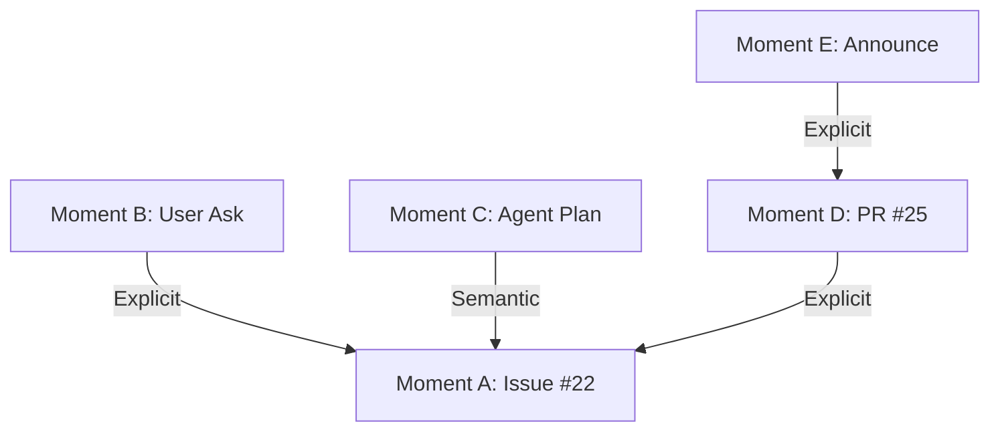

# Unified Pipeline Blueprint

## 1. Purpose

The **Machinen Engine** is the central processing brain for the Knowledge Graph. It transforms raw inputs (activity streams, docs) into structured Moments and Links.

It is designed to be **Unified**: exact same business logic runs in **Live** (Low Latency) and **Simulation** (High Throughput) modes.

## 2. Core Architecture: The Unified Orchestrator

To prevent "Live/Sim Schism", we enforce a single code path for execution.

### 2.1 The Single Loop
There is only one Orchestrator function: `executePhase`.

```typescript
// THE SINGLE SHARED CODE PATH
async function executePhase(
  phase: Phase, 
  input: any, 
  strategies: { storage: StorageStrategy, transition: TransitionStrategy },
  context: PipelineContext
) {
  // 1. Execute Logic (Identical)
  const output = await phase.execute(input, context);
  
  // 2. Persist State (Varies by Strategy)
  await strategies.storage.saveArtifact(phase, input, output);
  
  // 3. Trigger Next (Varies by Strategy)
  await strategies.transition.dispatchNext(getStep(phase).next, output);
}
```

### 2.2 Stateless Phase Execution via Context
Memory is our scarcest resource (128MB limit). We cannot pass huge objects between functions or hold the graph in memory.
Instead, we use **Stateless Execution with Context**.

**The Rule**: Logic functions are pure-ish. They accept an ID (`input`) and a capability bag (`context`). They MUST fetch what they need from the DB using the ID, and write their results back via the Context.

```typescript
type PhaseExecution<TInput, TOutput> = (
  input: TInput,
  context: PipelineContext // The Side-Effect Handle
) => Promise<TOutput>;

interface PipelineContext extends IndexingHookContext {
  db: Database;       // Read/Write Graph Data
  vector: VectorIndex; // Read/Write Embeddings
  env: Env;           // Config & Keys
  llm: LLMProvider;   // Reasoning
}
```

## 3. Plugin Architecture: Domain Injection

The Pipeline itself is generic. All domain-specific knowledge (how to parse GitHub, how to chunk Discord) is injected via **Plugins**.

Plugins live in `src/app/engine/plugins/`. They provide hooks for:
1.  **Ingestion/Diffing**: Converting raw JSON `{"issue_url": ...}` into a standardized `Document` object.
2.  **Chunking**: Breaking a `Document` into `Chunk[]` based on domain rules (e.g. separating PR body from comments).
3.  **Prompting**: Providing the context string ("This is a PR, assume text supports...") for the LLM.

## 4. The 8-Phase Lifecycle (Detailed Flow)

This data flow describes exactly what happens to a document as it moves through the system.

### Phase 1: Ingest & Diff
*   **Goal**: Fetch raw state and decide if it changed.
*   **Input**: `r2_key` (Pointer to raw JSON in object storage).
*   **Context Read**: 
    *   Fetches the JSON from R2.
    *   Checks `db.document_checksums` to see if we've processed this before.
*   **Validation**: Plugin parses R2 key -> validates structure -> normalizes to `Document`.
*   **Context Write**: Updates `db.document_checksums` if changed.
*   **Output**: `Document` object (in-memory) or `null` (if skipped).

### Phase 2: Micro-Batches (Chunk & Embed)
*   **Goal**: Prepare atomic units for Vector Search.
*   **Input**: `Document`.
*   **Context Read**: None (Pure transformation).
*   **Logic**: 
    1.  Plugin splits `Document` -> `Chunk[]`.
    2.  Model generates `Embedding` (Vector) for each Chunk.
*   **Context Write**: 
    *   Writes `embeddings` to Vector DB.
    *   Stores `MicroMoment` items in temporary artifact storage (not main DB yet).
*   **Output**: `MicroMoment[]` (List of chunks + vectors).

### Phase 3: Macro Synthesis (Interpretation)
*   **Goal**: Understand the "Stream of Consciousness".
*   **Input**: `MicroMoment[]`.
*   **Context Read**: None.
*   **Logic**: LLM reads the stream of text chunks and synthesizes a narrative summary ("User X proposed Y", "PR Z implemented Y").
*   **Context Write**: None.
*   **Output**: `MacroStream[]` (Draft moments).

### Phase 4: Classification
*   **Goal**: Filter noise and Tag.
*   **Input**: `MacroStream[]`.
*   **Logic**: LLM decides: Is this a "Bg Fix"? A "Feature Request"? Just "Chore"?
*   **Output**: `ClassifiedStream[]`.

### Phase 5: Materialize (The Commit)
*   **Goal**: Make it Real.
*   **Input**: `ClassifiedStream[]`.
*   **Context Read**: None.
*   **Context Write**: 
    *   **INSERT** into `moments` table. 
    *   Assigns permanent **UUIDs**.
*   **Output**: `Moment[]` (The graph nodes).

> **Sync Barrier**: Once this phase completes, the data is visible to the rest of the system.

### Phase 6: Deterministic Linking
*   **Goal**: Link what we know for sure (Zero Hallucination).
*   **Input**: `moment_id`.
*   **Context Read**: 
    *   Reads `moment` body. 
    *   Regex scan for identifiers (e.g., `Fixes #123`).
    *   `db.find('source_ref:github/123')`.
*   **Context Write**: 
    *   **INSERT** into `links` table (e.g. `PR -> Issue`).
*   **Output**: `ParentLink` structure (for logging).

### Phase 7: Candidate Generation (Search)
*   **Goal**: Find what *might* be related.
*   **Input**: `moment_id`.
*   **Context Utility**: `context.vector.query(embedding)`.
*   **Context Read**: 
    *   Vector Index returns top K matches (IDs + Scores).
    *   Fetches metadata for those IDs from `db`.
*   **Logic**: Filters out candidates created *after* the current moment (Basic causality check).
*   **Output**: `Candidate[]`.

> **Note**: This phase can only find candidates that have already been **Materialized** (Phase 5).

### Phase 8: Timeline Fit (The Judgment)
*   **Goal**: Finalize the Graph.
*   **Input**: `moment_id`, `Candidate[]`.
*   **Context Read**: None (uses input candidates).
*   **Logic**: 
    *   LLM reviews the pair (`Moment`, `Candidate`).
    *   **Veto Check**: Does the timeline make sense? (e.g. Can a PR fix an issue that doesn't exist yet?)
    *   **Semantic Check**: Is the link strong enough?
*   **Context Write**: 
    *   **INSERT** into `links` table if accepted.
    *   Log decision rationale (Why yes? Why no?).
*   **Output**: `FinalDecision`.

## 5. End-to-End Walkthrough: "The Prefetching Story"

**Scenario**: A feature lifecycle involving 5 distinct documents spanning 3 days.

**The Timeline**:
1.  **Day 1 10:00 (Doc A)**: GitHub Issue #22 "Support Prefetching".
2.  **Day 1 14:00 (Doc B)**: Discord User: "Can I prefetch links?" Team at-mention: "See #22".
3.  **Day 2 09:00 (Doc C)**: Discord Agent Chat: "How would I implement prefetching?" (Dev planning).
4.  **Day 3 10:00 (Doc D)**: GitHub PR #25 "Feat: Client-side prefetching. Solves #22".
5.  **Day 3 12:00 (Doc E)**: Discord Announcement: "Prefetching is out! See PR #25".

### Process Flow Execution

#### Step 1: Processing Doc A (Issue #22)
*   **Ingest**: Plugin validates Github Issue.
*   **Materialize**: Comes out as `Moment A (UUID: 111)`.
*   **Linking/Fit**: No candidates found (it's the first doc).

#### Step 2: Processing Doc B (Discord "See #22")
*   **Materialize**: Becomes `Moment B (UUID: 222)`.
*   **Deterministic Linking**:
    *   Regex finds "#22".
    *   `db.find('gh_issue:22')` -> Returns `Moment A`.
    *   **Write**: Link `B -> A (Explicit)`.

#### Step 3: Processing Doc C (Agent Chat)
*   **Micro-Batching**: Chunked into "Micro-Moment: How to implement...".
*   **Materialize**: Becomes `Moment C (UUID: 333)`.
*   **Candidate Generation**:
    *   `vector.query("implement prefetching")`.
    *   Results: `[Moment A (Issue), Moment Z (Noise)]`.
*   **Timeline Fit**:
    *   LLM Input: "Moment C matches Moment A. Valid?".
    *   Check: Day 2 (Chat) is after Day 1 (Issue). **PASS**.
    *   **Write**: Link `C -> A (Semantic)`.

#### Step 4: Processing Doc D (PR #25)
*   **Materialize**: Becomes `Moment D (UUID: 444)`.
*   **Deterministic Linking**:
    *   Regex finds "Solves #22".
    *   `db.find('gh_issue:22')` -> Returns `Moment A`.
    *   **Write**: Link `D -> A (Explicit)`.

#### Step 5: Processing Doc E (Announcement)
*   **Materialize**: Becomes `Moment E (UUID: 555)`.
*   **Deterministic Linking**:
    *   Regex finds "PR #25".
    *   `db.find('gh_pr:25')` -> Returns `Moment D`.
    *   **Write**: Link `E -> D (Explicit)`.

### The Final Graph

