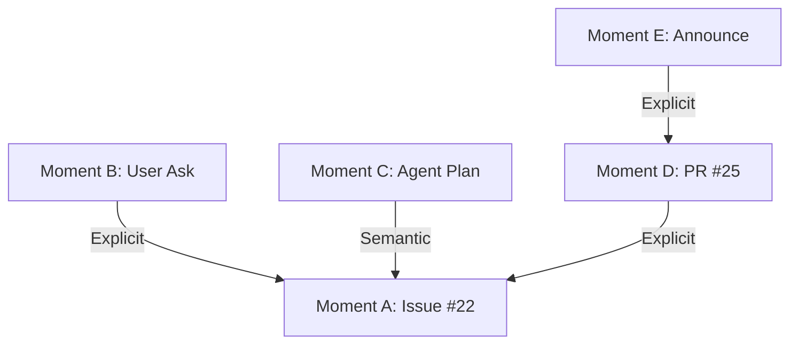

# Unified Pipeline Blueprint

## 1. Purpose

The **Machinen Engine** is the central processing brain for the Knowledge Graph. It transforms raw inputs (activity streams, docs) into structured Moments and Links.

It is designed to be **Unified**: exact same business logic runs in **Live** (Low Latency) and **Simulation** (High Throughput) modes.

## 2. Core Architecture: The Unified Orchestrator

To prevent "Live/Sim Schism", we enforce a single code path for execution.

### 2.1 The Single Loop
There is only one Orchestrator function: `executePhase`.

```typescript
// THE SINGLE SHARED CODE PATH
async function executePhase(
  phase: Phase, 
  input: any, 
  strategies: { storage: StorageStrategy, transition: TransitionStrategy },
  context: PipelineContext
) {
  // 1. Execute Logic (Identical)
  const output = await phase.execute(input, context);
  
  // 2. Persist State (Varies by Strategy)
  await strategies.storage.saveArtifact(phase, input, output);
  
  // 3. Trigger Next (Varies by Strategy)
  await strategies.transition.dispatchNext(getStep(phase).next, output);
}
```

### 2.2 Co-located Domain Logic
All logic is organized by **Domain** in `src/app/pipelines/<phase>/`.
*   **Core**: Shared Business Logic + Phase Definitions.
*   **Web**: UI Components.
*   **Live/Sim**: Strategy Definitions (if needed).

**CRITICAL CONSTRAINT**: There are **NO PER-PHASE RUNNERS**. The generic `executePhase` function handles everything.

### 2.3 Stateless Phase Execution
Phases use **Stateless Execution with Context**.
```typescript
type PhaseExecution<TInput, TOutput> = (
  input: TInput,
  context: PipelineContext // Provides DB Access, LLM, Env
) => Promise<TOutput>;
```

## 3. Execution Strategies

We inject behavior to handle the different constraints of Live vs Simulation.

### 3.1 Live Strategy (Minimizing Latency)
*   **Goal**: Process a webhook as fast as possible.
*   **Storage**: `NoOpStorage` (or `LogStorage`). We don't save intermediate state to DB to save milliseconds.
*   **Transition**: `DirectTransition`. We call the next function immediately in-memory (recursive chain).
*   **Context**: `LiveContext`. Connects to real-time environment.

### 3.2 Simulation Strategy (Maximizing Throughput & Inspectability)
*   **Goal**: Process 10,000+ items without crashing.
*   **Storage**: `ArtifactStorage`. We persist input/output to `simulation_run_artifacts` for checkpointing and UI debugging.
*   **Transition**: `QueueTransition`. We enqueue a job for the next phase. This breaks the stack, respects the 30s timeout, and allows the Supervisor to pace the work (Backpressure).
*   **Context**: `SimulationContext`. Can mock time or external APIs.

## 4. Work Unit Orchestration

### 4.1 Live (Push-Based)
*   **Trigger**: Webhook.
*   **Flow**: Webhook -> `executePhase(Ingest, LiveStrategies)`.
*   **Result**: The chain runs to completion (or failure) in seconds.

### 4.2 Simulation (Pull-Based)
*   **Trigger**: The Supervisor (Pacer).
*   **Flow**: Supervisor polls `simulation_run_artifacts` -> Dispatches Queue Job.
*   **Worker**: Calls `executePhase(Ingest, SimStrategies)`.
*   **Result**: State saved to DB. Next job enqueued. Worker exits.

## 5. Storage: The Artifacts Table (Sim Only)

The `simulation_run_artifacts` table is the "Tape" for the simulation machine.

| Column | Type | Description |
| :--- | :--- | :--- |
| `run_id` | PK | The simulation run ID. |
| `phase` | PK | The phase name (e.g., `micro_batches`). |
| `entity_id` | PK | The unit of work (e.g., `r2_key`, `moment_id`). |
| `input_json` | JSON | The arguments passed to the phase logic. |
| `output_json` | JSON | The result returned by the phase logic. |
| `status` | Enum | `pending`, `running`, `complete`, `failed`. |
| `retry_count` | Int | Application-level retry counter. |
| `error_json` | JSON | Last error details if failed. |

## 6. The 8-Phase Lifecycle

| Phase | Input (Artifact.entity_id) | Context needed | Output |
| :--- | :--- | :--- | :--- |
| **1. Ingest** | `r2_key` | R2 | `Chunks[]` |
| **2. Micro Batches** | `r2_key` | - | `MicroMoment[]` |
| **3. Macro Synthesis** | `r2_key` | LLM | `MacroStream[]` |
| **4. Classification** | `r2_key` | LLM | `ClassifiedStream[]` |
| **5. Materialize** | `r2_key` | DB Write | `Moment[]` (Graph IDs) |
| **6. Linking** | `moment_id` | DB Read (Index) | `ParentLink` |
| **7. Candidates** | `moment_id` | Vector DB | `Candidate[]` |
| **8. Timeline Fit** | `moment_id` | LLM, DB Read | `FinalDecision` |

## 7. System Constraints

1.  **UNIFIED ORCHESTRATOR**: There is only ONE execution code path: `executePhase`.
2.  **STRATEGY INJECTION**: Differences between Live/Sim are solely handled by `StorageStrategy` and `TransitionStrategy`.
3.  **QUEUE BOUNDARY (Sim)**: In Sim mode, `TransitionStrategy` MUST be async (Queue) to respect the 30s limit and concurrency controls.
4.  **No Per-Phase Runners**: All orchestration usage must go through the generic pipeline.
5.  **Statelessness**: Workers are ephemeral.

---

## 8. End-to-End Walkthrough: "The Prefetching Story"

**Scenario**: A feature lifecycle involving 5 distinct documents spanning 3 days.

**The Timeline**:
1.  **Day 1 10:00 (Doc A)**: GitHub Issue #22 "Support Prefetching".
2.  **Day 1 14:00 (Doc B)**: Discord User: "Can I prefetch links?" Team: "See #22".
3.  **Day 2 09:00 (Doc C)**: Discord Agent Chat: "How would I implement prefetching?" (Dev planning).
4.  **Day 3 10:00 (Doc D)**: GitHub PR #25 "Feat: Client-side prefetching. Solves #22".
5.  **Day 3 12:00 (Doc E)**: Discord Announcement: "Prefetching is out! See PR #25".

### Process Flow (Unified Pipeline)

#### Step 1: Materialization (Phases 1-5)
The system ingests all 5 documents.
*   **Live**: Happens sequentially as Webhooks arrive.
*   **Sim**: Happens in parallel/batched chunks managed by Supervisor.
*   **Result**: 5 `Moment` rows in the IDB. Initially unlinked.

#### Step 2: Deterministic Linking (Phase 6)
*   **Doc B (Discord)**: Logic detects "See #22".
    *   `context.db.find('gh:22')` -> Returns Moment A.
    *   **Link**: B -> A (Explicit).
*   **Doc D (PR)**: Logic detects "Solves #22".
    *   `context.db.find('gh:22')` -> Returns Moment A.
    *   **Link**: D -> A (Explicit).
*   **Doc E (Announce)**: Logic detects "See PR #25".
    *   `context.db.find('gh:25')` -> Returns Moment D.
    *   **Link**: E -> D (Explicit).

#### Step 3: Candidate Generation (Phase 7)
*   **Doc C (Agent Planning)**: "How would I implement prefetching?"
    *   No explicit link.
    *   `context.vector.query("implement prefetching")`.
    *   **Result**: Returns Moment A (Issue #22 "Support Prefetching") + noise.
    *   **Candidates**: `[Moment A, Moment Z, Moment Y]`.

#### Step 4: Timeline Fit (Phase 8)
*   **Doc C (Agent Planning) -> Candidate A (Issue #22)**
    *   **LLM Judge**:
        *   Context: "User is planning implementation for valid request."
        *   Timeline Check: Day 2 is AFTER Day 1 (Issue) and BEFORE Day 3 (PR).
    *   **Decision**: Link C -> A (High Confidence).

### The Final Graph

